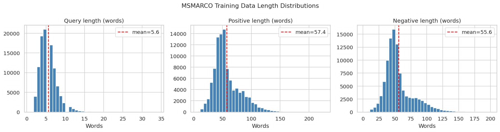
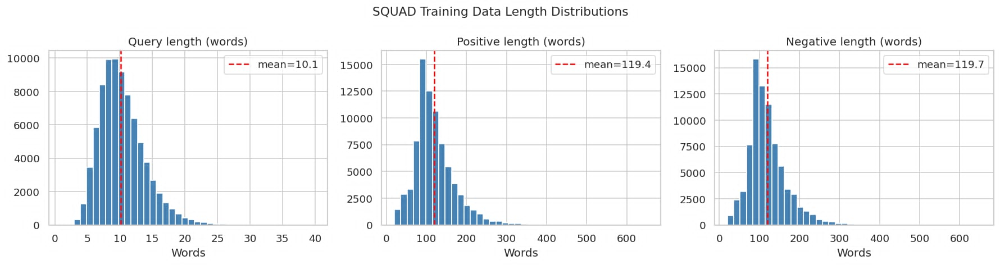
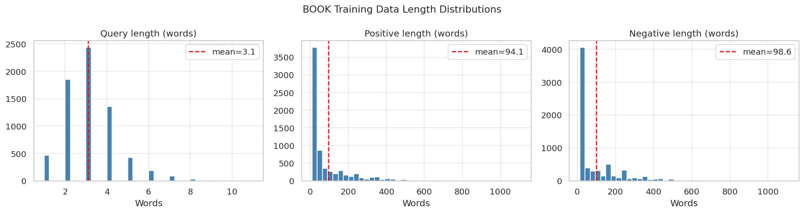

# Neural Search Engine — NLP Final Project

Neural search over the Jurafsky & Martin *Speech and Language Processing* textbook, using a custom transformer trained from scratch with InfoNCE contrastive learning.

## Setup

```bash
pip install -r requirements.txt
# For GPU training (recommended):
pip install torch --index-url https://download.pytorch.org/whl/cu121
pip install faiss-gpu  # instead of faiss-cpu
```

## Pipeline

### Download training data
```python
from src.data import download_msmarco
download_msmarco(train_size=100_000, val_size=5_000)
```

### Build Train/Validation data from the book
```bash
python -m src.bookdata
```

### Chunk J&M corpus
```python
from src.data import chunk_pdfs
chunk_pdfs(["data/raw/jm_corpus/slp3_ch1.pdf", ...])
```

### Train the model
```bash
python -m src.train
```

### Build indexes
```python
from src.train import load_model
from src.retrieval import FAISSRetriever, BM25Retriever, TFIDFRetriever
from src.data import load_chunks

model, tokenizer = load_model("checkpoints/best_model.pt")
chunks = load_chunks()

faiss_ret = FAISSRetriever()
faiss_ret.build(chunks, model, tokenizer)
faiss_ret.save()

bm25_ret = BM25Retriever()
bm25_ret.build(chunks)
bm25_ret.save()

tfidf_ret = TFIDFRetriever()
tfidf_ret.build(chunks)
tfidf_ret.save()
```

### Evaluate
See `notebook.ipynb` — Section 4 (Results).

### Demo
```bash
streamlit run app.py
```

## Data Collection / Preprocessing

This are some of the datasets we have used for this project:

### MS MACRO v2.1
100, 000 Bing Questions, with real human answers. It contains relevant and irrelevant answers for any given query. We can choose relevant answer as the positive answer to the question and the irrelevant one as a negative answer to the query.



### SQuAD (Stanford Question Answering Dataset)
Contains Wikipedia article questions and contexts from which the questions are answearable. We take the question as a query and context as a positive answer.
We pick random context from any data point that is not the positive answer and we let it be the negative answer in the triplet.



### Speech and Language Processing Book as Dataset
The problem we encountered was that the previous 2 datasets did not have a lot of ML/NLP terminology. The solution is to turn the SLP book into a dataset itself.
We looked up the subject index for the book which has listed different words and the pages the words are explained on.
We have encountered a few problems while we were turning the SLP book into a dataset.

#### Problem 1: Each page might contain parts of different sections
*Solution:* Implement per-section chunking to separate section texts.

#### Problem 2: Some word explanations are too close to each other, so the positive texts might overlap
*Solution:* Only capture the window that contains the index term, limit the window size.

#### Problem 3: How to avoid data leakage between train/validation?
*Solution:* Split the data not by index terms, but by Sections!

#### Problem 4: How to find hard negatives?
*Solution:* use BM25 to rank every possible answer, exclude positive and pick one of the closest matches.

#### Data Augmentation
After all this the data we received was still small in size, so we used data augmentation to put each query into predefined templates like
- what is [query]
- how [query] works
- explain [query]

And explanded the size of the dataset this way. The final dataset size was:

- **Train Set:** 6870 rows
- **Val Set:** 2754 rows



## Model Architecture

Custom transformer encoder (no pretrained weights):
- Token embedding: up to 30,000 × 256 (vocab size set by training data)
- Sinusoidal positional encoding
- 4× TransformerEncoderLayer (d=256, heads=4, ffn=512, pre-norm)
- Mean pooling + L2 normalization → 256-dim embedding

Loss: InfoNCE with in-batch negatives, temperature=0.05

## Project Structure

```
src/
  model.py      - Custom TextEncoder (from scratch)
  losses.py     - InfoNCE loss
  data.py       - MS MARCO download, J&M chunking, Dataset
  train.py      - Training loop
  retrieval.py  - FAISS + BM25 + TF-IDF retrievers
  metrics.py    - Recall@K, MRR@K, NDCG@K
app.py          - Streamlit demo
notebook.ipynb  - Analysis, training, evaluation
```
