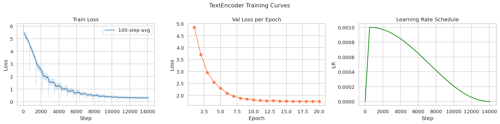
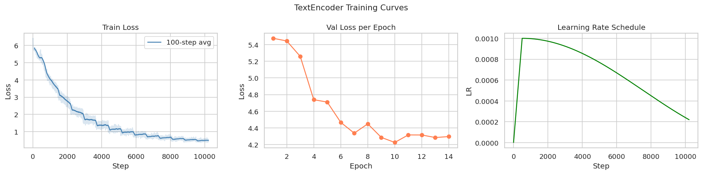
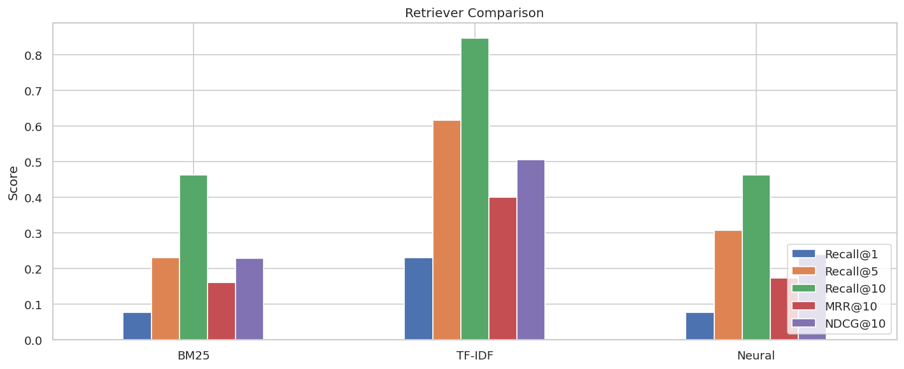
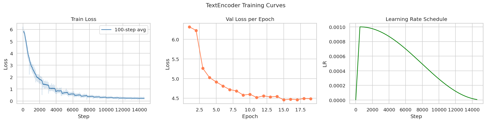
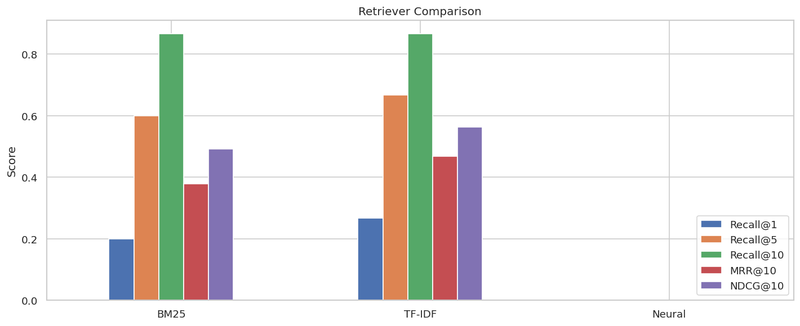

# Neural Search Engine — NLP Final Project


> Authors: Dachi Suramelashvili, Vasiko Vazagaevi

## Setup

```bash
pip install -r requirements.txt
# GPU training (recommended):
pip install torch --index-url https://download.pytorch.org/whl/cu121
```

## Quick Start

```bash
# Run the demo
streamlit run app.py
```

## Project Structure

```
src/
  model.py      - TextEncoder (transformer from scratch)
  tokenizer.py  - BPE tokenizer training and loading
  losses.py     - InfoNCE contrastive loss
  data.py       - MS MARCO / SQuAD download, PDF chunking, TripletDataset
  train.py      - Training loop with AMP, early stopping, LR schedule
  retrieval.py  - Dense (neural), BM25, TF-IDF retrievers
  metrics.py    - Recall@K, MRR@K, NDCG@K, MeanRank
app.py          - Streamlit demo (dataset selector + method comparison)
report/         - Detailed methods report
data/processed/ - Tokenizer, triplets, chunks, eval qrels
checkpoints/    - Saved model checkpoints
```


## Data Collection / Preprocessing

This are some of the datasets we have used for this project:

### MS MACRO v2.1
100, 000 Bing Questions, with real human answers. It contains relevant and irrelevant answers for any given query. We can choose relevant answer as the positive answer to the question and the irrelevant one as a negative answer to the query.


### SQuAD (Stanford Question Answering Dataset)
Contains Wikipedia article questions and contexts from which the questions are answearable. We take the question as a query and context as a positive answer.
We pick random context from any data point that is not the positive answer and we let it be the negative answer in the triplet.


### Speech and Language Processing Book as Dataset
The problem we encountered was that the previous 2 datasets did not have a lot of ML/NLP terminology. The solution is to turn the SLP book into a dataset itself.
We looked up the subject index for the book which has listed different words and the pages the words are explained on.
We have encountered a few problems while we were turning the SLP book into a dataset.

#### Problem 1: Each page might contain parts of different sections
*Solution:* Implement per-section chunking to separate section texts.

#### Problem 2: Some word explanations are too close to each other, so the positive texts might overlap
*Solution:* Only capture the window that contains the index term, limit the window size.

#### Problem 3: How to avoid data leakage between train/validation?
*Solution:* Split the data not by index terms, but by Sections!

#### Problem 4: How to find hard negatives?
*Solution:* use BM25 to rank every possible answer, exclude positive and pick one of the closest matches.

#### Data Augmentation
After all this the data we received was still small in size, so we used data augmentation to put each query into predefined templates like
- what is [query]
- how [query] works
- explain [query]

And explanded the size of the dataset this way. The final dataset size was:

- **Train Set:** 6870 rows
- **Val Set:** 2754 rows


## Tokenizer

A BPE tokenizer was trained from scratch on the full training corpus (MS MARCO + SQuAD + book triplets + J&M chunks). Vocabulary size: 50,000 tokens (it covered ~98% of the training corpus).

BPE was chosen over simple word tokenization because it handles out-of-vocabulary terms gracefully: rare words are split into known subword pieces rather than replaced with `[UNK]`. This is particularly important for NLP-domain terminology. A word like `"subword"` may not appear in MS MARCO but can be reconstructed from `"sub"` + `"word"`. The tokenizer was trained on the J&M chunks specifically to ensure NLP terminology is represented in the vocabulary.

## Architecture

### Why this architecture?

For this problem we used a bi-encoder approach, where each query and positive/negative passage is passed through the model separately to obtain embeddings. We chose this architecture for its simplicity and speed, as other options, such as cross-encoder, which processes the query and passage together, are not suitable for fast retrieval since it would require passing all possible (query, passage) pairs through the model, even though it would yield better results. Consequently, this model maps both questions and answers into a single embedding space, allowing for easy pairing based on cosine similarity.

### Model: TextEncoder

```
Input tokens (question - 64 , answer - 256)
    |
Token Embedding  [vocab_size × 256]
    |
Sinusoidal Positional Encoding
    |
4× Transformer Encoder Layer
    (d_model=256, heads=4, FFN=512, Pre-LN, dropout=0.1)
    |
Masked Mean Pooling (256d)
    |
L2 Normalization (unit vector for stable cosine similarity)
```

**Total parameters: ~14.9M**

A few architectural decisions:

- **Pre-LayerNorm (norm_first=True):** The original Post-LN is more unstable during training from scratch, while Pre-LN stabilizes training better according to sources.

- **Mean pooling over CLS token:** The CLS token is not specifically used during training, so its embedding may not be sufficiently informative. Mean pooling takes the average of all token embeddings, which is a better and more intuitive choice in this case.

- **Asymmetric max lengths (64 for queries, 256 for passages):** Queries are often much shorter than passages. Reducing the size speeds up training and inference, while 256 tokens are sufficient to capture the full content of passages.

## Loss Function

### Why InfoNCE?

InfoNCE is used because in retrieval, there is no clear right or wrong. It depends on the query and the selection, but ultimately, the correct answer should have the highest score among other answers. Hard negatives also help in this task, as they are thematically similar to the correct answer but incorrect. Such hard negatives will still get high scores in a weak model, forcing the model to learn correctly.

```
loss = -log( exp(sim(q_i, p_i) / τ) / Σ_j exp(sim(q_i, p_j) / τ) )
```

Mathematically, it is identical to cross-entropy, where the correct class is the corresponding answer. The temperature τ controls the sharpness of the softmax - lower values penalize small ranking errors more strictly.

The loss is symmetric: queries evaluate their answers (`loss_q`) and answers evaluate their queries (`loss_p`), and then it is averaged. This keeps the encoder consistent in both directions.

**In-batch negatives** are inherently present. Since the batch size is 256, 255 of them are effectively random negatives. Based on this, we can establish a baseline for random selection: `log(256) ≈ 5.55`.

The temperature was initially `τ = 0.02`, but it was increased to `τ = 0.07`.  

## Training

### Data

| Dataset | Train | Val | Negative type |
|---|---|---|---|
| MS MARCO | 100,000 | 5,000 | BM25 non-clicked passages |
| SQuAD 2.0 | 80,000 | 5,000 | BM25-mined (top result ≠ gold context) |
| Book triplets | 6,870 -> ×4 oversampled | 2,754 | Same-book passages |

MS MARCO provides the largest volume and the best hard negatives (answers that were retrieved but not clicked are naturally informative negatives).
SQuAD provides a signal for understanding questions.
Book triplets were generated from J&M and conversation processing guidelines to ensure the model learns the NLP-domain lexicon - without this, the model performs well on web-based questions but struggles with tokenization, attention mechanisms, and similar topics in questions.

Book triplets were oversampled to be quantitatively comparable with other datasets.

### Training Curve

The model was trained several times in different ways, but the main experiments were 3:
1. General: trained only on MS MARCO + SQuAD 2.0 (compared to WW2 Wikipedia page)
2. NLP-domain: trained on MS MARCO + SQuAD 2.0 + book triplets (~28k triplets) (compared to JM's book)
3. NLP-domain with oversampling: trained on MS MARCO + book triplets ×4 oversampling (~112k triplets) (compared to JM's book)

The goal of (1) was to see if our model could learn the language properly, while the goal of (2) and (3) was to achieve good performance on JM's book.

Often, models start around `log(256) ≈ 5.55` on validation at the beginning of training and then decrease, indicating that initially it is random and gradually learns more.

The gap between train loss (0.46) and val loss (4.23) at convergence is expected: training uses hard negatives making it a harder problem (2B candidates), while validation uses in-batch negatives only (B candidates). They are not directly comparable — val random baseline is 5.55, train random baseline is 6.24, and the final val loss of 4.23 is meaningfully below random.

Full training curves with plots are available in `notebook.ipynb`.

### Optimizer and Schedule

- **AdamW** with `lr=1e-3`, `weight_decay=0.01`. Adam's adaptive per-parameter learning rates handle the different gradient scales across embedding, attention, and FFN layers naturally.
- **Cosine LR schedule with 500-step warmup.** At initialization, gradients are noisy - starting the learning rate from zero and ramping up gradually prevents the optimizer from making large destructive updates before the loss landscape stabilizes.
- **Mixed precision (AMP)** with `GradScaler`. Roughly 2× speedup on GPU with no accuracy loss. Essential for fitting batch size 256 on 8GB VRAM.
- **Gradient clipping** at norm 1.0. Hard negatives create sharper loss landscapes with occasional large gradient spikes that would otherwise destabilize training.

## Experiments

### 1. General: trained only on MS MARCO + SQuAD 2.0 (compared to WW2 Wikipedia page)




As we can see, the model, when trained on a dataset with good pos/neg entries, can learn the language well and perform well on a different domain (WW2 Wikipedia), even beating BM25. However, it struggles with NLP-domain questions, as it has not seen the vocabulary and concepts in the book triplets.

### 2. NLP-domain: trained on MS MARCO + SQuAD 2.0 + book triplets (~28k triplets) (compared to JM's book)




In this experiment, the model was trained on the book triplets to learn the NLP-domain vocabulary and concepts. As a result, it did learn some of the NLP-domain vocabulary and concepts, but it was not enough to outperform BM25 on the NLP-domain questions. This is likely due to the small number of triplets (28k) compared to the other datasets (100k MS MARCO + 80k SQuAD 2.0). The model may have overfit to the small number of triplets and not generalized well to the NLP-domain questions.

### 3. NLP-domain with oversampling: trained on MS MARCO + book triplets ×4 oversampling (~112k triplets) (compared to JM's book)




In this experiment, the model was trained on the book triplets with oversampling to learn the NLP-domain vocabulary and concepts. However, the model performed much worse than the previous experiment. This is likely due to the fact that the model was trained on a much larger number of triplets (112k) compared to the other datasets (100k MS MARCO). The model may have overfit to the large number of triplets and not generalized well to the NLP-domain questions.

## Evaluation

### Corpora

Two main corpora were selected to test different aspects of the retrieval system:

- **J&M NLP Textbook** (`chunks_nlp.jsonl`): The primary target domain. Tests whether the model learned NLP-specific vocabulary and concepts from the book triplets.
- **WW2 Wikipedia** (`chunks_wiki.jsonl`): A factual question-answering domain, different in style from both textbooks. Tests generalization to encyclopedia-style prose.

### Metrics

- **Recall@K**: Does the correct chunk appear anywhere in the top K results? Measures whether the system can find the answer at all. Primary metric for practical usefulness.
- **MRR@K**: Average of 1/rank across queries. Measures whether the correct answer is ranked near the top, not just present somewhere.
- **NDCG@K**: Similar to MRR but with a logarithmic discount curve - smoother penalty for lower ranks. Standard metric in information retrieval literature.
- **MeanRank**: Average rank of the correct chunk with no cutoff. Reveals the severity of failures - a system with Recall@10=0.8 but MeanRank=40 is missing queries badly, while MeanRank=3 means the model is barely missing.